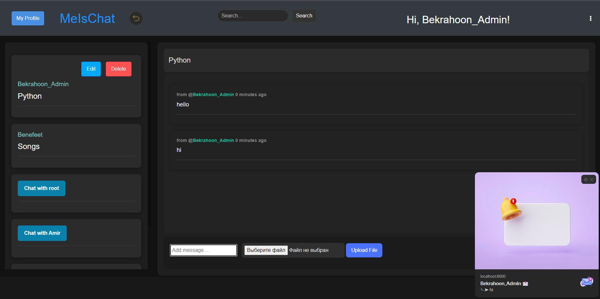
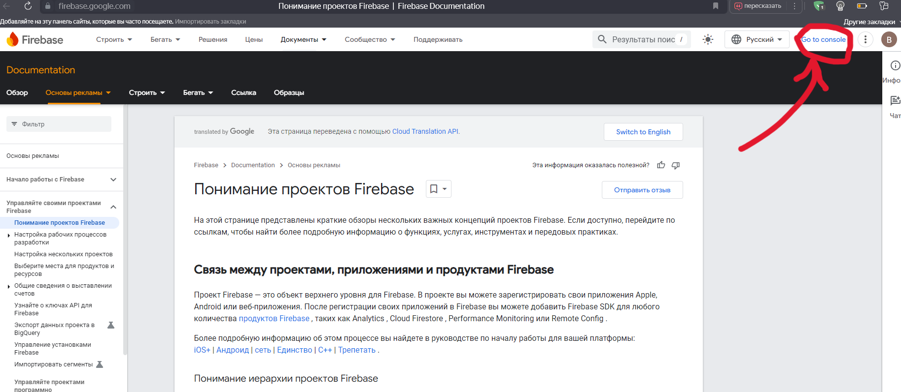

# MeisChat

*This app is using ***Django 5.1.1*** and Python ***3.12.3****

## Table of contents

- [MeisChat](#meischat)
  - [Table of contents](#table-of-contents)
  - [An example of how the home page might look like:](#an-example-of-how-the-home-page-might-look-like)
  - [Links to sources:](#links-to-sources)
    - [Back-end](#back-end)
  - [Running this app with docker](#running-this-app-with-docker)
      - [Clone this repo:](#clone-this-repo)
      - [Copy an example .env file because the real one is git ignored:](#copy-an-example-env-file-because-the-real-one-is-git-ignored)
      - [Build  and run the app with Docker:](#build--and-run-the-app-with-docker)
      - [Setup the initial database:](#setup-the-initial-database)
      - [Check it out in a browser:](#check-it-out-in-a-browser)
      - [Linting the code base:](#linting-the-code-base)
      - [Sorting Python imports in the code base:](#sorting-python-imports-in-the-code-base)
      - [Formatting the code base:](#formatting-the-code-base)
      - [Running the test suite:](#running-the-test-suite)
      - [Stopping everything:](#stopping-everything)
  - [Firebase:](#firebase)

## An example of how the home page might look like:



## Links to sources:

### Back-end
- [PostgreSQL](https://www.postgresql.org/)
- [Redis](https://redis.io/)
- [Docker](https://www.docker.com/get-started/)


## Running this app with docker


#### Clone this repo:

```sh
git clone https://github.com/bekrahoon/MeisChat.git hellodjango
cd hellodjango
```

#### Copy an example .env file because the real one is git ignored:

```sh
cp .env.example .env
```

#### Build  and run the app with Docker:

```sh
docker compose up --build
```

Now that everything is built and running we can treat it like any other Django
app.

Did you receive a `depends_on` "Additional property required is not allowed"
error? Please update to at least Docker Compose v2.20.2+ or Docker Desktop
4.22.0+.

Did you receive an error about a port being in use? Chances are it's because
something on your machine is already running on port 8000. Check out the docs
in the `.env` file for the `DOCKER_WEB_PORT_FORWARD` variable to fix this.

Did you receive a permission denied error? Chances are you're running native
Linux and your `uid:gid` aren't `1000:1000` (you can verify this by running
`id`). Check out the docs in the `.env` file to customize the `UID` and `GID`
variables to fix this.

#### Setup the initial database:

```sh
# You can run this from a 2nd terminal.
./run manage migrate
```

*We'll go over that `./run` script in a bit!*

#### Check it out in a browser:

Visit <http://localhost:8000> in your favorite browser.

#### Linting the code base:

```sh
# You should get no output (that means everything is operational).
./run lint
```

#### Sorting Python imports in the code base:

```sh
# You should see that everything is unchanged (imports are already formatted).
./run format:imports
```

#### Formatting the code base:

```sh
# You should see that everything is unchanged (it's all already formatted).
./run format
```

*There's also a `./run quality` command to run the above 3 commands together.*

#### Running the test suite:

```sh
# You should see all passing tests. Warnings are typically ok.
./run manage test
```

#### Stopping everything:

```sh
# Stop the containers and remove a few Docker related resources associated to this project.
docker compose down
```

You can start things up again with `docker compose up` and unlike the first
time it should only take seconds.


## Firebase:

-  [Firebase](https://firebase.google.com/docs/projects/learn-more?hl=ru)
  
  In order to get the key and all the necessary things in firebase you need to go to the link to register and go to the project console, and then to the section "`Project Options`" and find "`API-key`".
****

After you get the Firebase key, create a cred folder and put the key there. `json`
